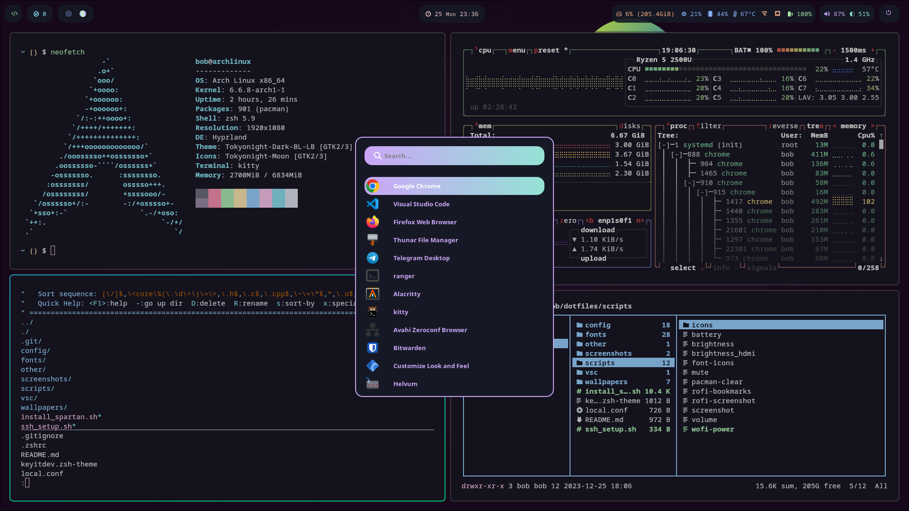

# dotfiles
Arch Linux dotfiles

## Config 1 - Wayland-Hyprland

**OS**: arch linux

**Display Server**: Wayland server

**Display Manager/Login Manager**: sddm

**Window Manager**: Hyprland

**Compositor**: Wayland compositor

**Desktop Environment**: //

**Search Tool**: wofi

**Toolbar**: waybar

**File Manager**: ranger (and thunar)

**Shell & Terminal**: zsh, alacritty

**Additional packages**: git, zathura, neovim, btop, ...

## Config 2 - Xorg-i3

**OS**: arch linux

**Display Server**: Xorg 11

**Display Manager/Login Manager**: sddm

**Window Manager**: i3-wm

**Compositor**: picom

**Desktop Environment**: //

**Search Tool**: rofi

**Toolbar**: polybar

**File Manager**: thunar

**Shell & Terminal**: zsh, alacritty

**Additional packages**: git, zathura, neovim, btop, ...

# Todo
- Colemak-DH i3 config file
- Colemak-DH wayland config file
- neovim config
- i3 improve overall look
- waybar fix
